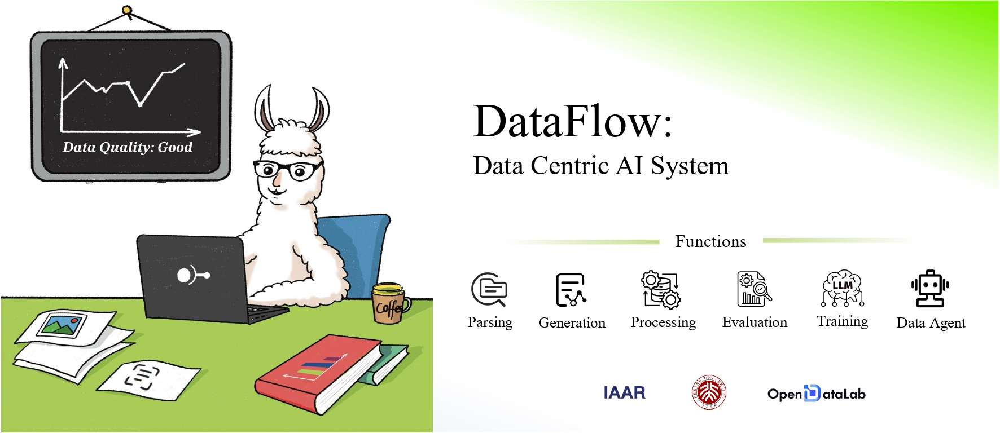

# Dataflow-MM 多模态

<div align="center">
  

[](https://OpenDCAI.github.io/Dataflow-MM-Doc/)
[](https://github.com/OpenDCAI/Dataflow-MM/blob/main/LICENSE)
[](https://github.com/OpenDCAI/Dataflow-MM)
[](https://github.com/OpenDCAI/Dataflow-MM/issues)
[](https://github.com/OpenDCAI/Dataflow-MM/graphs/contributors)
[](https://github.com/OpenDCAI/Dataflow-MM)

<!-- [](https://github.com/OpenDCAI/Dataflow-MM/commits/main/) -->

🎉 如果你认可我们的项目，欢迎在 GitHub 上点个 ⭐ Star，关注项目最新进展。

简体中文 | [English](./README.md)
</div>

## 快速开始

使用以下命令安装：

```bash
cd ./Dataflow-MM-MM
conda create -n Dataflow-MM python=3.12
pip install -e .
```

## 音频测试

额外环境安装：

```bash
pip install -e ".[audio]"
pip install -e ".[vllm]"
```

测试命令：

```bash
python test/test_whisper_promptedvqa.py
python test/test_audio_promptedvqa.py
```

# nano-banana (gemini-v2.5-image) 测试

测试命令：

```bash
python test/test_image_editing.py --api_key < your api key >
```

我们使用来自 [yucha](http://123.129.219.111:3000/) 的 API。
